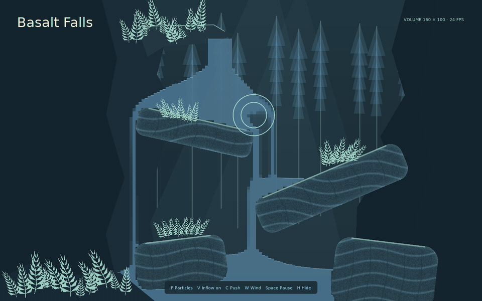

# gpuparticles

[](https://github.com/Kyonru/gpuparticles/actions/workflows/quality.yml)
[](https://kyonru.github.io/gpuparticles/)
[](LICENSE)

GPU particles, collision, and material volumes for **LÖVE 11.x**. No compute shaders or runtime dependencies.

gpuparticles keeps spawn records and simulation state on the GPU. Simple effects draw hundreds of thousands of particles with one instanced call; stateful effects add environment collision, mouse obstacles, attractors, and flow fields. A separate grid simulation provides accumulating water, rising smoke, editable terrain, and thermal reactions.



## When should I use it?

Use LÖVE's built-in [`ParticleSystem`](https://love2d.org/wiki/ParticleSystem) for ordinary effects with modest counts. It is mature, simple, widely supported, and already integrated into LÖVE.

Use gpuparticles when the effect needs something the native system does not provide:

- tens or hundreds of thousands of particles with minimal CPU update work;
- deterministic seeded playback;
- more than eight color or size stops;
- curl noise, turbulence, attractors, or GPU flow fields;
- collision with floors, heightfields, signed-distance fields, or moving circles, boxes, and capsules;
- selectable collision responses: bounce, slide, stop, disappear, and respawn;
- optional approximate particle-to-particle contact;
- optional depth, so particles can orbit and pass behind a sprite, allocating state only when simulated;
- water that spreads and accumulates, smoke that advects and rises, or materials that react.

| Behavior | System |
| --- | --- |
| Sparks, trails, rain, embers, stylized smoke | Analytic particles |
| Particles that collide or follow current-position forces | Stateful particles |
| Persistent pools, redirected waterfalls, smoke volumes | Material volumes |
| Small conventional effects with maximum compatibility | LÖVE `ParticleSystem` |

`mode = 'auto'` keeps eligible emitters analytic and selects stateful simulation only when required. Unsupported particle hardware falls back to LÖVE's native system. Material volumes return an error reason because no native equivalent exists.

## Install

Download a [release](https://github.com/Kyonru/gpuparticles/releases) and copy the complete `gpuparticles/` directory into your game:

```text
my-game/
├── main.lua
└── gpuparticles/
```

## Particle example

```lua
local gpu = require('gpuparticles')
local emitter

function love.load()
  emitter = gpu.newEmitter {
    max = 50000,
    mode = 'auto',
    seed = 42,
    rate = 2000,
    lifetime = {1, 2.5},
    position = {400, 500},
    direction = -math.pi / 2,
    spread = math.pi / 6,
    speed = {80, 220},
    gravity = {0, 300},
    damping = 0.4,
    sizes = {8, 12, 0},
    colors = {
      {1, 0.835, 0.118, 1},
      {1, 0.275, 0.478, 0.7},
      {0.314, 0.012, 0.753, 0},
    },
    blendMode = 'add',
  }
  emitter:warm(1.5)
end

function love.update(dt) emitter:update(dt) end
function love.draw() emitter:draw() end
function love.quit() emitter:release() end
```

Add a moving collision circle by configuring `circleCollider` and updating it from the mouse:

```lua
emitter = gpu.newEmitter {
  max = 20000,
  rate = 5000,
  lifetime = 3,
  gravity = {0, 300},
  circleCollider = {x=400, y=250, radius=45, particleRadius=2},
}

function love.update(dt)
  local x, y = love.mouse.getPosition()
  emitter:setCircleCollider(x, y, 45)
  emitter:update(dt)
end
```

This configuration automatically selects the stateful backend. Use a small fixed timestep for fast particles and thin collision geometry.

## Persistent water or smoke

Use a volume world when material should remain in the environment instead of expiring by particle lifetime:

```lua
local world, reason = gpu.newVolumeWorld {
  width = 1280,
  height = 720,
  cellSize = 8,
  renderStyle = 'pixel', -- or 'smooth'
}
assert(world, reason)

local water = world:addMaterial {name='water', model='water'}
world:newSource {
  material = water,
  position = {640, 40},
  radius = 20,
  rate = 12000,
}

function love.update(dt) world:update(dt) end
function love.draw() world:draw() end
function love.quit() world:release() end
```

## Editor and examples

```sh
love .                         # effect browser
love . editor                  # layered Particle Studio and Lua export
love . library                 # browsable collection of fifteen effect recipes
love . comparison              # native/GPU FPS comparison
love . waterfall               # collision and persistent water
love . volume                  # water, smoke, and steam
love . custom-shaders          # custom GLSL movement and fragment glow
love . colliders               # moving circles, boxes, and capsules
love . sdf-groups              # shared SDF with selective player/enemy collision
love . bench                   # local performance measurements
```

Read the [documentation](https://kyonru.github.io/gpuparticles/) for installation, forces, collision, textures, pixel-art rendering, volume materials, editor usage, performance, and the complete APIs.

## Limits

- LÖVE 11.x has no compute shaders; simulation uses float-canvas fragment passes.
- Large translucent sprites can become fill-rate bound regardless of particle count.
- Particle alpha/depth sorting is not provided; additive blending is the safest default.
- Collision is discrete, and optional self-collision is an approximate quadratic-cost solver.
- Volume simulation is a stylized grid model rather than engineering fluid dynamics.

See [CONTRIBUTING.md](CONTRIBUTING.md) for development setup, documentation builds, verification, and pull-request guidance. Licensed under the [MIT License](LICENSE).

Planned particle, volume, editor, and compatibility work is tracked in [ROADMAP.md](ROADMAP.md).
