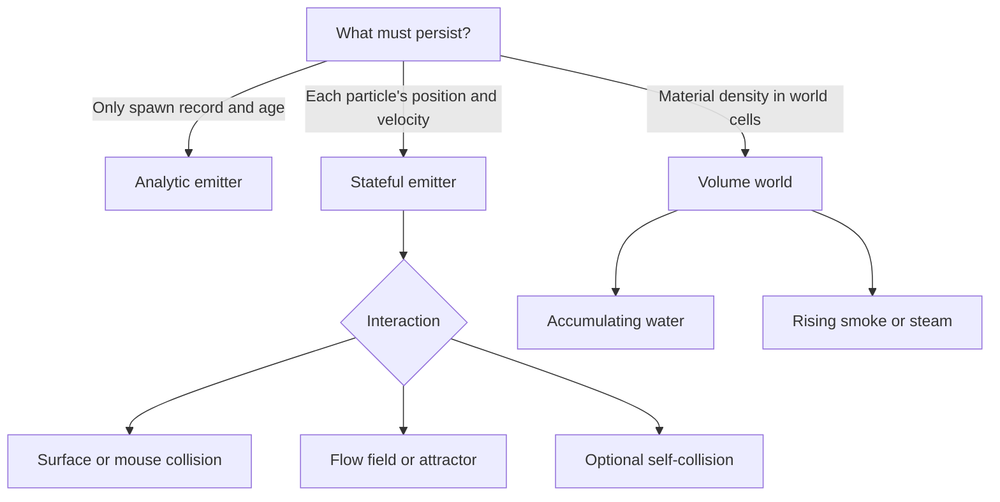

# Choose a system

Start with the effect's behavior. Particle count alone does not require stateful simulation.



## Analytic emitter

Choose it for motion that is a closed-form function of age: gravity, damping, radial or tangential acceleration, sinusoidal turbulence, curl noise, and stateless custom displacement. Particle state is never stepped or read back.

```lua
local emitter = gpu.newEmitter {
  mode = 'auto',
  gravity = {0, 180},
  forces = {gpu.forces.curl {amplitude=35, frequency=0.8}},
}
assert(emitter:getMode() == 'analytic')
```

## Stateful emitter

Choose it when the next position depends on the current position: collision, attractors, flow fields, or a custom stateful force. Position and velocity live in nearest-filtered float canvases that ping-pong each update.

```lua
local emitter = gpu.newEmitter {
  mode = 'auto',
  collision = {type='plane', y=600, radius=3, bounce=0.3},
}
assert(emitter:getMode() == 'stateful')
```

## Volume world

Choose a volume when material should remain after individual particles would expire. Water occupies cells and flows into available neighbors. Gas has density, heat, velocity, buoyancy, advection, and pressure projection.

This makes volumes suitable for pools, redirected waterfalls, smoke filling a room, and water-to-steam conversion. A volume is intentionally separate from an emitter: it has resolution and solver costs instead of particle count and lifetime.

## What `auto` checks

Any configured collision, circle collider, nonempty attractor list, flow field, self-collision, or custom force marked `stateful=true` selects stateful mode. Everything else remains analytic. Explicit `mode='analytic'` rejects stateful features with a clear error.

Always assert the expected mode in examples and tests:

```lua
assert(emitter:getMode() == 'analytic', 'this effect should stay on the cheap path')
```
