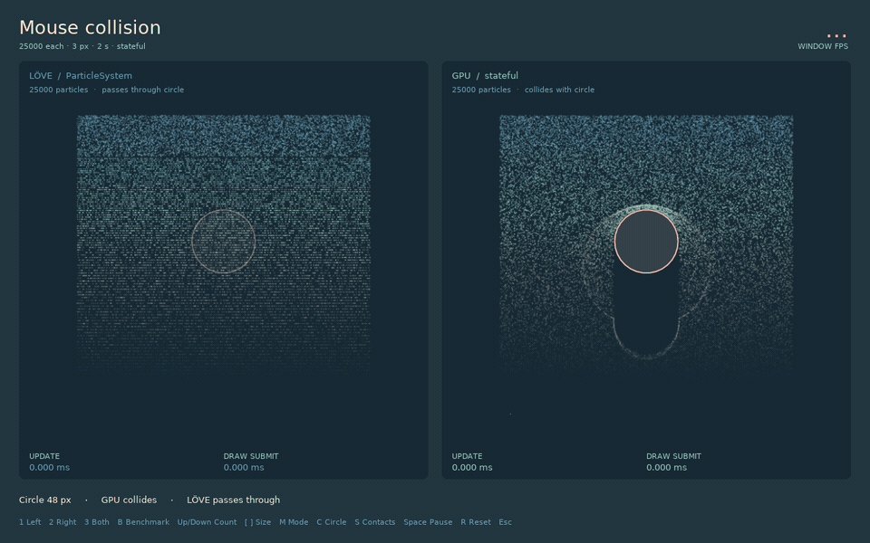

# Collision

Collision requires current particle state, so `mode='auto'` selects the stateful backend. The solver projects a penetrated particle out of a surface and changes its normal and tangential velocity using bounce and friction.



| Need | Collider |
| --- | --- |
| Flat floor or ceiling | Plane |
| One terrain height for each x-coordinate | Heightfield |
| Caves, islands, or arbitrary silhouettes | Signed distance field |
| A moving gameplay obstacle | Circle, box, or capsule |
| Approximate contact within one emitter | Self-collision |

## Choose a contact response

`collisionResponse` applies to the emitter's static field and all its moving colliders:

```lua
local emitter = gpu.newEmitter {
  collisionResponse = 'slide',
  collision = {type='plane', y=600, radius=3, friction=0.08},
}

emitter:setCollisionResponse('bounce') -- uniform-only runtime change
```

| Response | Result |
| --- | --- |
| `bounce` | Reflect inward normal velocity using bounce; damp tangential velocity using friction |
| `slide` | Remove inward normal velocity; retain tangential motion with friction |
| `stop` | Zero velocity at contact; later forces can move the particle again |
| `disappear` | Hide the particle until its ring slot naturally recycles |
| `respawn` | Restore the particle's recorded spawn position and initial velocity |

`bounce` is the default. These responses run entirely in the simulation shader and do not create Lua collision events. Sticking or attaching to a surface requires persistent contact and collider identity state and remains planned in the [roadmap](https://github.com/Kyonru/gpuparticles/blob/main/ROADMAP.md).

## Floor plane

```lua
collision = {
  type = 'plane',
  y = 600,
  radius = 3,
  bounce = 0.7,
  friction = 0.1,
}
```

The region below `y` is solid. Collision radius is independent of the displayed sprite size.

## Heightfield

```lua
collision = {
  type = 'heightfield',
  texture = heightImage,
  origin = {0, 0},
  size = {1920, 1080},
  scale = 1080,
  bias = 0,
  radius = 3,
  bounce = 0.35,
}
```

The red texture channel becomes surface height through `origin.y + red * scale + bias`. A heightfield represents one surface height per x-coordinate and is efficient for ground, hills, and waterfall rocks without overhangs.

## Signed distance field

```lua
collision = {
  type = 'sdf',
  texture = sdfImage,
  origin = {0, 0},
  size = {1920, 1080},
  scale = 1,
  bias = 0,
  radius = 3,
  bounce = 0.2,
}
```

The red channel stores signed distance in world pixels after scale and bias. Positive values are outside the solid. Its gradient supplies the contact normal, allowing caves, islands, and arbitrary silhouettes.

### Generate an SDF at load time

An SDF texel stores the shortest distance to the surface. The sign identifies the side: positive is open space, zero is the boundary, and negative is solid. Store world-pixel distances directly in a float image:

```lua
local function circleSdf(x, y, cx, cy, radius)
  local dx, dy = x-cx, y-cy
  return math.sqrt(dx*dx + dy*dy) - radius
end

local function makeSdf(worldWidth, worldHeight)
  local tw, th = 480, 320
  local data = love.image.newImageData(tw, th, 'rgba32f')
  data:mapPixel(function(column, row)
    local x = (column+0.5) / tw * worldWidth
    local y = (row+0.5) / th * worldHeight
    local floor = worldHeight-64-y
    local pillar = circleSdf(x, y, 480, 420, 72)
    return math.min(floor, pillar), 0, 0, 1 -- union
  end)
  local image = love.graphics.newImage(data)
  data:release()
  image:setFilter('linear', 'linear')
  image:setWrap('clamp', 'clamp')
  return image
end
```

Pass the resulting image as `collision.texture` with `scale=1` and `bias=0`. Release it after every emitter using it has been released.

Combine primitive distances before storing them:

| Shape operation | Distance expression |
| --- | --- |
| Union: either shape is solid | `math.min(a, b)` |
| Intersection: both are solid | `math.max(a, b)` |
| Subtract B from A | `math.max(a, -b)` |

For a normalized image where red `0.5` is the boundary and the represented distance range is ±128 pixels, use `scale=256` and `bias=-128`.

### SDF practices

- Generate static terrain once during loading. Do not rebuild an `ImageData` every frame.
- Derive the visible geometry and SDF from the same shape data so their boundaries agree.
- Use linear filtering for continuous distance interpolation and clamp wrapping at the edges.
- Include enough empty margin outside obstacles for the particle radius and texture-gradient samples.
- Increase texture resolution around thin features. Features narrower than about two texels are unreliable.
- Keep `origin` and `size` aligned with the simulation coordinate system, including camera transforms.
- Use heightfields for ordinary ground without caves or overhangs; they need less texture data.

The [waterfall](../tools/examples.md#waterfall) uses one SDF assembled from several rotated rounded rectangles. The [collision-groups example](../tools/examples.md#sdf-collision-groups) combines a floor, pillar, and shelf, then shares the field across several emitters.


## Moving circle, box, and capsule

Reserve a moving obstacle in the initial configuration:

```lua
local emitter = gpu.newEmitter {
  max = 20000,
  rate = 5000,
  lifetime = 3,
  circleCollider = {
    x = 400, y = 250,
    radius = 45,
    particleRadius = 2,
    bounce = 0.2,
    friction = 0.03,
  },
  boxCollider = {width=140, height=70, particleRadius=2, enabled=false},
  capsuleCollider = {x1=300, y1=250, x2=500, y2=300, radius=24, particleRadius=2, enabled=false},
}

function love.update(dt)
  local x, y = love.mouse.getPosition()
  emitter:setCircleCollider(x, y, 45)
  -- Or move another reserved shape:
  -- emitter:setBoxCollider(x, y, 140, 70)
  -- emitter:setCapsuleCollider(x-70, y-20, x+70, y+20, 24)
  emitter:update(dt)
end
```

Calling a collider setter with no arguments disables that shape. Boxes remain axis-aligned; capsule endpoints can describe any orientation. One collider of each shape can coexist with the texture/plane collision field. The deepest penetration wins when shapes overlap.

All three setters only change uniforms. They do not upload particle data, rebuild shaders, or read state back to the CPU. Coordinates must be in simulation space: undo camera translation, scale, or viewport transforms before sending pointer coordinates. Colliders do not transfer their velocity and can skip particles when moved too far between simulation steps.


## Players, enemies, and selective collision

An emitter is the current collision-filtering boundary. Particles in the same emitter share its static field and moving colliders. Split particles by behavior when only some should react:

| Emitter group | Static SDF | Player circle | Enemy shapes |
| --- | :---: | :---: | :---: |
| Ambient dust | Yes | No | No |
| Player sparks | Yes | Yes | No |
| Enemy debris | Yes | No | Yes |

```lua
local function common(color)
  return {
    max=6000, rate=1200, lifetime={2,4},
    colors=color,
    collision={type='sdf', texture=levelSdf, size={levelWidth,levelHeight}},
  }
end

local ambient = gpu.newEmitter(common(ambientColors))

local playerConfig = common(playerColors)
playerConfig.circleCollider = {radius=32, enabled=false}
local playerFx = gpu.newEmitter(playerConfig)

function love.update(dt)
  playerFx:setCircleCollider(player.x, player.y, player.radius)
  ambient:update(dt)
  playerFx:update(dt)
end
```

Share the SDF texture rather than creating a copy per emitter. Each stateful emitter still owns separate particle-state canvases and runs its own simulation pass, so group by collision behavior instead of creating an emitter for every actor.

The current API supports one circle, one box, and one capsule per emitter. For several stationary enemies, include them in the shared SDF. For a few moving enemies, assign the available moving shapes to the relevant emitter group. A large crowd of independently moving colliders needs future collider-array support; creating dozens of matching emitters would multiply simulation and draw cost.

Keep gameplay authority on the CPU. GPU particle collision should produce the visual response, while damage, hit detection, pickups, and AI use the game’s normal collision system. Reading particle contacts back every frame stalls the GPU.

## Particle-to-particle collision

```lua
selfCollision = {
  radius = 6,
  bounce = 0.2,
  strength = 0.8,
  iterations = 1,
}
```

This optional visual solver treats live particles in one emitter as equal-radius circles. It separates overlapping pairs and exchanges approaching normal velocity. It does not provide fluid volume, rigid-body accuracy, cross-emitter contact, per-sprite shapes, or continuous collision detection.

Enabled self-collision has a hard capacity of 24,000 slots and worst-case GPU work proportional to `iterations × capacity²`. Use it for bounded effects with visible contacts. A persistent waterfall pool is better represented by a [water volume](../volumes/water.md).

## Stable stepping

Use a small fixed step for repeatable stateful collision:

```lua
local accumulator = 0
local step = 1 / 120

function love.update(dt)
  accumulator = accumulator + math.min(dt, 0.1)
  while accumulator >= step do
    emitter:update(step)
    accumulator = accumulator - step
  end
end
```

Collision is discrete projection. Fast particles can tunnel through thin geometry at large timesteps.
