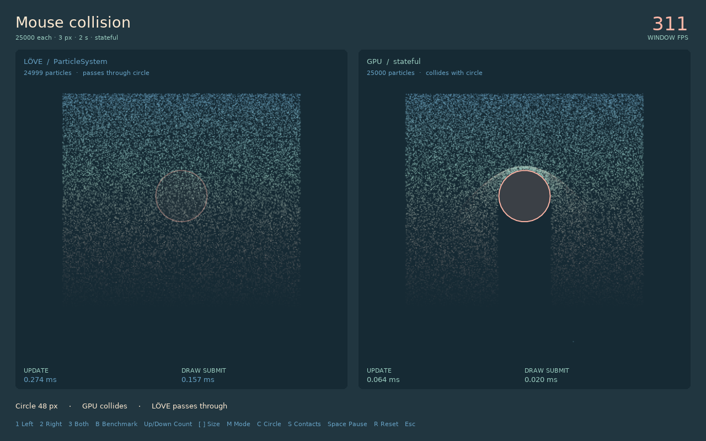
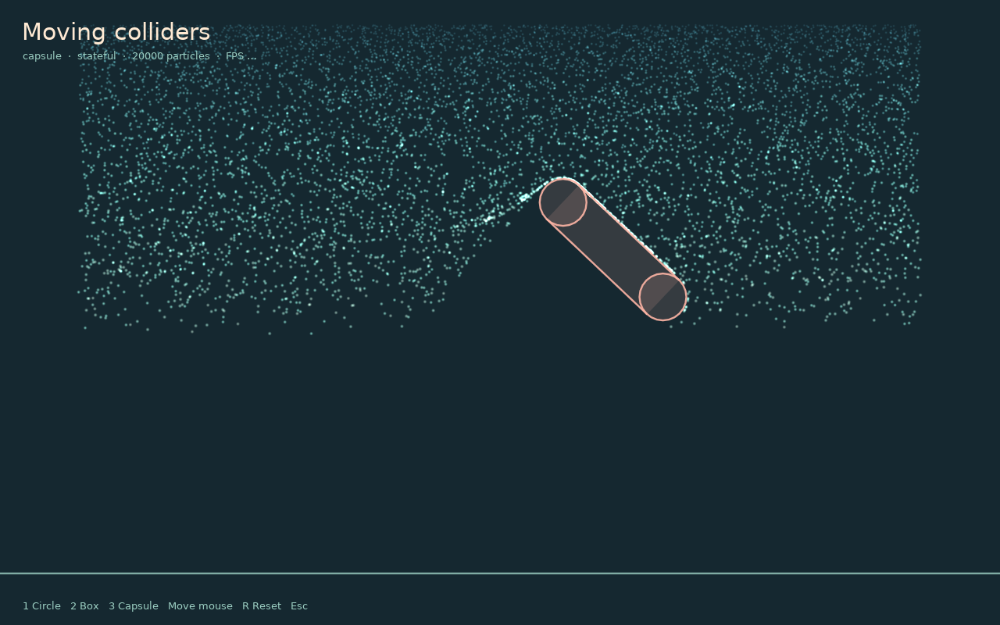

# Collision

Collision requires current particle state, so `mode='auto'` selects the stateful backend. The solver projects a penetrated particle out of a surface and changes its normal and tangential velocity using bounce and friction.



## Floor plane

```lua
collision = {
  type = 'plane',
  y = 600,
  radius = 3,
  bounce = 0.7,
  friction = 0.1,
}
```

The region below `y` is solid. Collision radius is independent of the displayed sprite size.

## Heightfield

```lua
collision = {
  type = 'heightfield',
  texture = heightImage,
  origin = {0, 0},
  size = {1920, 1080},
  scale = 1080,
  bias = 0,
  radius = 3,
  bounce = 0.35,
}
```

The red texture channel becomes surface height through `origin.y + red * scale + bias`. A heightfield represents one surface height per x-coordinate and is efficient for ground, hills, and waterfall rocks without overhangs.

## Signed distance field

```lua
collision = {
  type = 'sdf',
  texture = sdfImage,
  origin = {0, 0},
  size = {1920, 1080},
  scale = 1,
  bias = 0,
  radius = 3,
  bounce = 0.2,
}
```

The red channel stores signed distance in world pixels after scale and bias. Positive values are outside the solid. Its gradient supplies the contact normal, allowing caves, islands, and arbitrary silhouettes.

## Moving circle, box, and capsule

Reserve a moving obstacle in the initial configuration:

```lua
local emitter = gpu.newEmitter {
  max = 20000,
  rate = 5000,
  lifetime = 3,
  circleCollider = {
    x = 400, y = 250,
    radius = 45,
    particleRadius = 2,
    bounce = 0.2,
    friction = 0.03,
  },
  boxCollider = {width=140, height=70, particleRadius=2, enabled=false},
  capsuleCollider = {x1=300, y1=250, x2=500, y2=300, radius=24, particleRadius=2, enabled=false},
}

function love.update(dt)
  local x, y = love.mouse.getPosition()
  emitter:setCircleCollider(x, y, 45)
  -- Or move another reserved shape:
  -- emitter:setBoxCollider(x, y, 140, 70)
  -- emitter:setCapsuleCollider(x-70, y-20, x+70, y+20, 24)
  emitter:update(dt)
end
```

Calling a collider setter with no arguments disables that shape. Boxes remain axis-aligned; capsule endpoints can describe any orientation. One collider of each shape can coexist with the texture/plane collision field. The deepest penetration wins when shapes overlap.

All three setters only change uniforms. They do not upload particle data, rebuild shaders, or read state back to the CPU. Coordinates must be in simulation space: undo camera translation, scale, or viewport transforms before sending pointer coordinates. Colliders do not transfer their velocity and can skip particles when moved too far between simulation steps.



## Particle-to-particle collision

```lua
selfCollision = {
  radius = 6,
  bounce = 0.2,
  strength = 0.8,
  iterations = 1,
}
```

This optional visual solver treats live particles in one emitter as equal-radius circles. It separates overlapping pairs and exchanges approaching normal velocity. It does not provide fluid volume, rigid-body accuracy, cross-emitter contact, per-sprite shapes, or continuous collision detection.

Enabled self-collision has a hard capacity of 24,000 slots and worst-case GPU work proportional to `iterations × capacity²`. Use it for bounded effects with visible contacts. A persistent waterfall pool is better represented by a [water volume](../volumes/water.md).

## Stable stepping

Use a small fixed step for repeatable stateful collision:

```lua
local accumulator = 0
local step = 1 / 120

function love.update(dt)
  accumulator = accumulator + math.min(dt, 0.1)
  while accumulator >= step do
    emitter:update(step)
    accumulator = accumulator - step
  end
end
```

Collision is discrete projection. Fast particles can tunnel through thin geometry at large timesteps.
