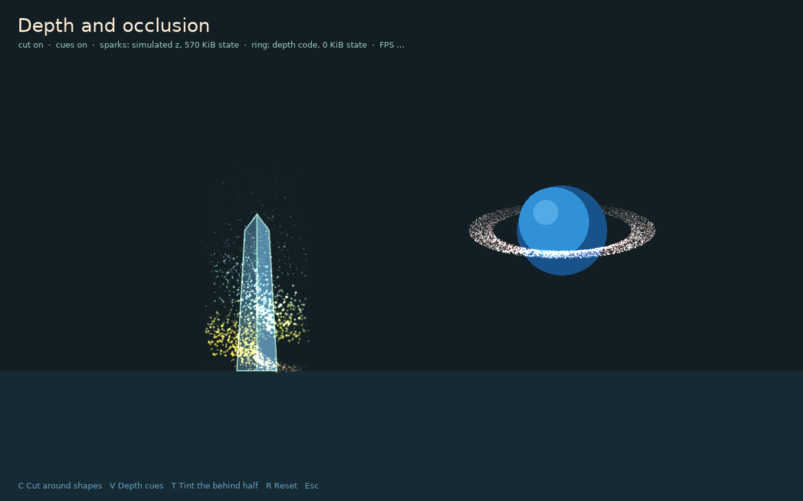

# Depth and occlusion

A 2D particle has no depth, so an effect meant to wrap around something, such as sparks circling a character or a ring around a planet, draws straight over it. Give the emitter a `depth` and each particle carries a z value: positive is in front of the plane at z = 0, negative is behind it. Draw the emitter twice around the object and the half behind is hidden by it.



Depth is opt-in. An emitter without `depth` allocates nothing extra, compiles no depth code, and renders exactly as before.

## Choose where z comes from

| Need | Use | Memory |
| --- | --- | --- |
| Motion you already describe with a formula, such as a scripted ring or helix | `depth = {code = ...}` | None: z is computed while drawing |
| Motion that depends on forces, attractors, collision, or anything stateful | Simulated z, `depth = {orbit = ...}` | Two small textures: 16 bytes per slot, or 32 if the GPU cannot mix formats |

## Draw around an object

```lua
emitter:draw(0, 0, {cut = 'behind', range = 40})
drawCharacter()
emitter:draw(0, 0, {cut = 'front', range = 40})
```

`range` is the z distance that counts as fully behind or fully in front. Particles within a quarter of it fade between the two passes instead of popping, and the two passes always add up to one full draw, so nothing is drawn twice.

Two optional cues sell the depth further, and work with or without a cut:

| Option | Default | Effect |
| --- | --- | --- |
| `size` | `0` | Scale sizes by `1 + size * depth`: nearer particles grow, farther ones shrink |
| `dim` | `0` | The back loses up to this fraction of its brightness |

`tilt`, set on the emitter's `depth`, shifts each particle down the screen by `tilt * z`, so a circle in x/z reads as an ellipse seen slightly from above.

## Formula depth

Depth code is a GLSL function body that receives `seed` and `age` and returns z. Pair it with a custom force that uses the same angle, and the depth is exact:

```lua
local angle = 'seed * 6.2831853 + age * 0.9'
local ring = gpu.newEmitter {
  max = 9000, rate = 3000, lifetime = 3, position = {640, 360},
  forces = {gpu.forces.custom {
    name = 'ring',
    code = ('float theta = %s; return vec2(cos(theta) * 130.0, sin(theta) * 39.0);'):format(angle),
  }},
  depth = {code = ('return sin(%s) * 130.0;'):format(angle)},
}
```

Depth code does not change the emitter's mode: an analytic ring stays analytic. Emitters with the same depth code share one shader variant.

## Simulated z

Without `code`, `depth` adds z and z velocity to the particle state and selects stateful simulation:

| Setting | Default | Meaning |
| --- | --- | --- |
| `axis` | emitter x | World x of the vertical axis particles orbit |
| `orbit` | `0` | Orbit rate in radians per second; scalar or `{min, max}` per particle |
| `gravity` | `0` | Constant z acceleration |
| `emission` | `0` | Random z spread at birth |
| `speed` | `0` | Extra z velocity at birth; scalar or range |
| `tilt` | `0` | Screen y per unit of z |

A particle is born moving round the axis at its orbit rate, and a spring pulls it back towards the axis in the x/z plane, so it circles instead of swinging across. Everything else still acts on x and y, so attractors can draw an orbit in and upward:

```lua
local sparks = gpu.newEmitter {
  max = 6000, rate = 1500, lifetime = {2.2, 3}, position = {400, 590},
  emissionArea = {distribution = 'uniform', x = 80, y = 4},
  direction = -math.pi / 2, speed = {20, 45}, gravity = {0, -36},
  attractors = {{x = 400, y = 300, strength = 900000, softening = 90}},
  depth = {axis = 400, orbit = {2.2, 3.4}, tilt = 0.28},
}
```

Damping applies to z as it does to x and y. A `respawn` collision restores birth z along with birth position.

## Cost and limits

- **Memory:** `emitter:getStateMemory()` reports the bytes held in particle state. A stateful emitter holds five float textures (80 bytes per slot); simulated z adds 16. Formula depth adds nothing.
- **GPU work:** simulated z writes position and z in the same simulation pass. Each cut doubles the draw calls for that emitter, not the simulation.
- **One plane per cut:** a cut splits at z = 0 around one object drawn between the passes. Several objects at different depths need more passes or a depth buffer, which is not provided.
- **2D interactions:** attractors, colliders, flow fields, and self-collision act in x and y and ignore z.
- **Fallback:** LÖVE's native `ParticleSystem` has no z. A behind pass draws nothing and a front pass draws everything, so a scene still renders correctly, without the occlusion.

Run `love particle-gpu depth` or `love particle-gpu/examples/depth` to compare both kinds side by side.
