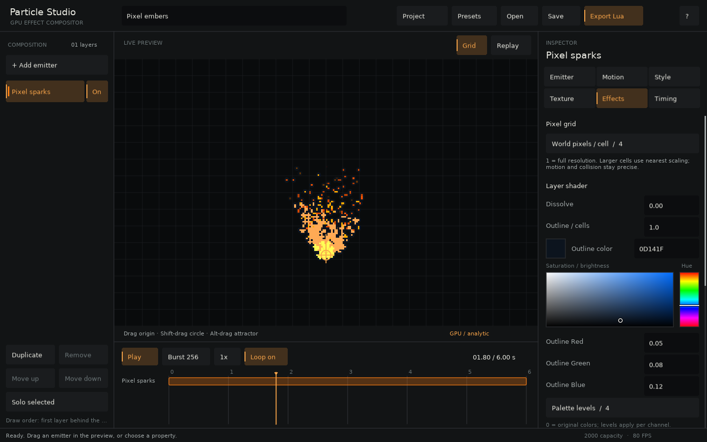

# Configure and render particles

`gpu.newEmitter(config)` creates an active emitter. Start with capacity, emission, motion, and appearance; add stateful features only when the effect needs them.

## Essential settings

| Setting | Default | Meaning |
| --- | --- | --- |
| `max` | `1000` | Ring-buffer slots |
| `mode` | `'auto'` | Automatic, analytic, or stateful |
| `rate` | `0` | Continuous particles per second |
| `lifetime` | `{1,1}` | Life in seconds, scalar or range |
| `position` | `{0,0}` | Simulation origin |
| `direction`, `spread` | `0`, `0` | Heading and full angular spread |
| `speed` | `{0,0}` | Initial speed range |
| `gravity`, `damping` | `{0,0}`, `0` | Acceleration and exponential drag |
| `sizes` | `{8,0}` | Billboard width over life |
| `colors` | white → transparent | RGB/RGBA stops over life |
| `blendMode` | `'add'` | LÖVE draw blend mode |
| `seed` | `1` | Private deterministic seed |

For continuous emission, begin with `max >= rate * maximumLifetime`. Extra slots leave room for bursts.

## Choose a spawn shape

```lua
emissionArea = {
  distribution = 'uniform',
  x = 80, y = 12,
  angle = 0,
  directionRelative = false,
}
```

Use `none`, `uniform`, `normal`, `ellipse`, `borderellipse`, or `borderrectangle`. Rectangle values are half-extents; normal values are standard deviations.

## Shape color and size

Stops are evenly spaced across normalized particle life. The GPU backend accepts up to 32 stops.

```lua
emitter:setSizes(2, 8, 12, 8, 0)
emitter:setColors(
  {1.00, 0.92, 0.83, 0},
  {1.00, 0.71, 0.65, 1},
  {0.40, 0.64, 0.77, 0}
)
emitter:setSizeVariation(0.35)
```

Curve changes affect living GPU particles. Spawn-setting changes rebuild `max` deterministic records, so make them during loading or editor interaction.

## Use a texture

Without a texture, the library generates a soft white disc.

```lua
local image = love.graphics.newImage('spark.png')
image:setFilter('nearest', 'nearest')

local emitter = gpu.newEmitter {
  texture = image,
  sizes = {16, 10, 0},
  colors = {{1,1,1,1}, {1,0.71,0.65,0}},
}
```

White sprites tint cleanly. The game owns `image` and releases it separately.

### Animate a sprite sheet

Pass LÖVE quads in lifetime order:

```lua
local frames = {}
for column = 0, 3 do
  frames[#frames+1] = love.graphics.newQuad(column*16, 0, 16, 16, image:getDimensions())
end

emitter = gpu.newEmitter {texture=image, quads=frames}
```

The limit is 256 frames. Billboards stay square, so square frames preserve proportions. Pad linear-filtered atlas frames to avoid neighboring-frame bleed.

## Pixel-art recipe

Use nearest filtering, integer draw positions, and render the whole effect to a low-resolution canvas before integer scaling. Particle Studio automates this with **World pixels / cell** and includes four animated pixel sheets.



## Rotation recipe

```lua
emitter:setRotation(-0.2, 0.2)
emitter:setSpin(-3, 3)
emitter:setSpinVariation(0.5)
emitter:setRelativeRotation(true)
emitter:setOffset(8, 8)
```

Relative rotation follows ballistic or simulated velocity. Analytic noise displacement does not change orientation.

Use `getMode()`, `getBackend()`, and `getFallbackReason()` for diagnostics. `getCount()` scans spawn metadata in `O(max)`; avoid it in a large emitter’s frame loop.
