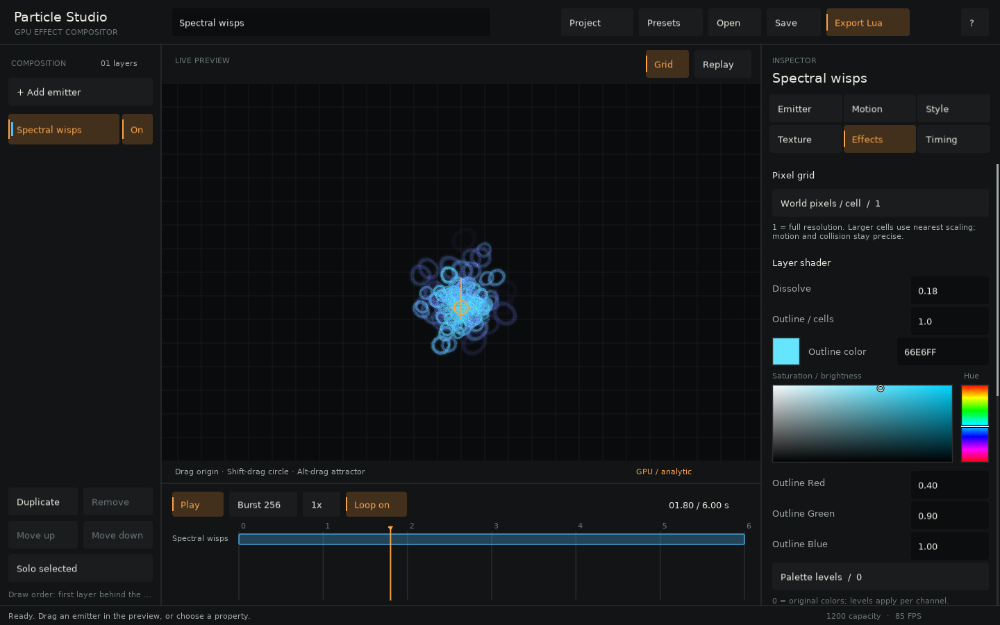

# Particle Studio

Particle Studio builds layered effects and exports standalone Lua that needs only the `gpuparticles/` directory.

```sh
love particle-gpu editor
```



## Build an effect

The editor supports up to 12 layers. Each layer selects its cheapest backend independently and shows that backend in the preview.

- **Emitter** controls capacity, rate, seed, lifetime, position, direction, speed, and spawn area.
- **Motion** adds acceleration, damping, curl, turbulence, an attractor, a flow field, floor/circle collision, contact responses, and optional self-collision.
- **Style** edits color and size curves, variation, rotation, spin, and blend mode.
- **Texture** imports PNG files, configures regular sprite sheets, selects generated shapes, and includes four pixel-art sheets.
- **Effects** applies pixel grids, dissolve, outlines, palette levels, tint, distortion, and glow to a layer.
- **Timing** schedules emission windows and bursts on a shared timeline.

Number fields support typing and direct manipulation: hold and drag right or up to increase, left or down to decrease. Shift makes finer adjustments. Values clamp to their displayed minimum and maximum. Color pickers remain visible for lifetime stops, tint, and enabled outlines.

## Interact with the preview

- Drag to move the selected emitter.
- Shift-drag to move its circle collider.
- Alt/Option-drag to move its attractor.
- Drag the timeline playhead to seek.
- Press Space to play or pause and R to replay.

Analytic effects seek directly. Stateful effects replay simulation in bounded batches so the interface remains responsive.

## Save and export

Projects are versioned JSON files with embedded imported images. **Export Lua** writes a self-contained effect module with the same scheduler and appearance renderer as the preview.

```lua
local effect

function love.load()
  effect = require('ember-fountain').new()
end

function love.update(dt) effect:update(dt) end
function love.draw() effect:draw() end
function love.quit() effect:release() end
```

Exports expose `update(dt)`, `draw(x, y, bounds)`, `seek(seconds)`, `reset()`, `burst(layerIndex, count)`, and `release()`. Copy the entire `gpuparticles/` directory beside the exported module.

## Current boundary

The editor does not yet author volume worlds, arbitrary GLSL, painted SDFs, nonuniform atlases, or keyframed parameter lanes. It exports the particle layers and appearance effects it previews.
