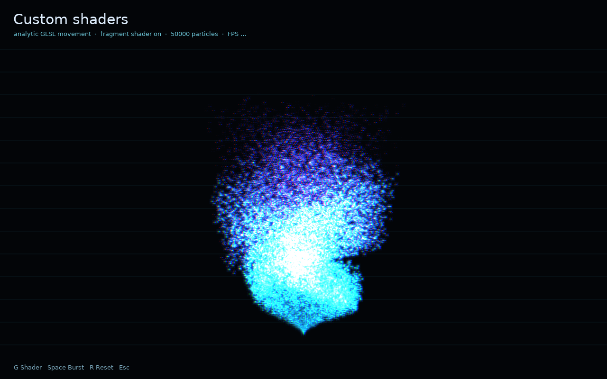
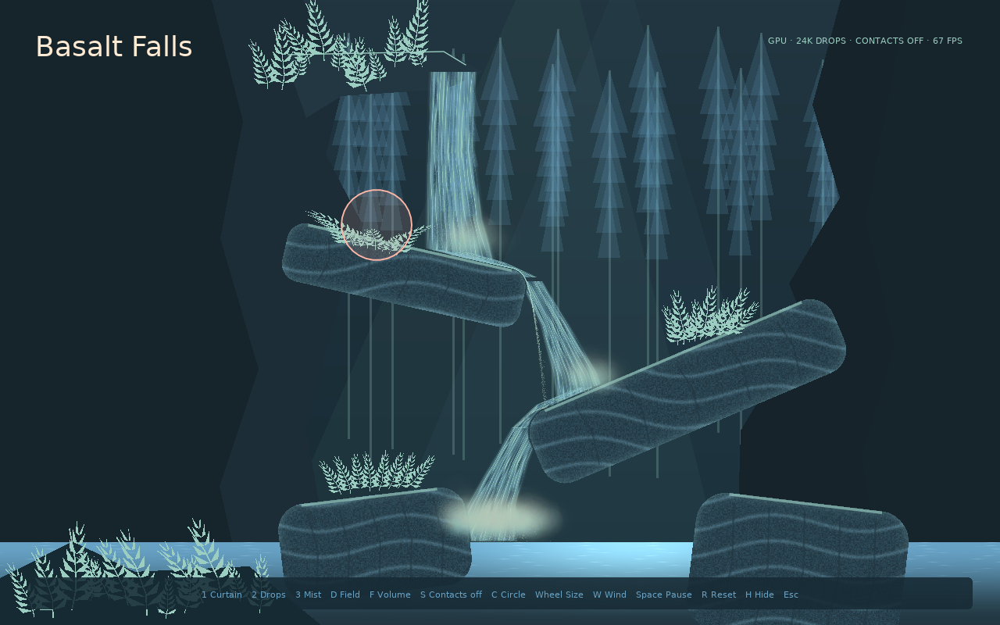
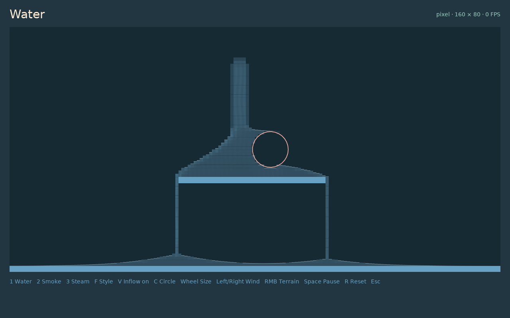

# Examples and comparison

The repository contains runnable projects for individual forces, collision, the editor, persistent materials, and performance comparisons.

## Effect browser

```sh
love particle-gpu
```

Use the arrow keys to select an effect and Space to emit. Each named force is also a standalone project, for example:

```sh
love particle-gpu/examples/curl
love particle-gpu/examples/flow
love particle-gpu/examples/heightfield
love particle-gpu/examples/sdf
```

The example runner asserts that every effect selected the expected mode.

## Custom shaders

```sh
love particle-gpu/examples/custom-shaders
```

This example injects a seeded helix displacement with `gpu.forces.custom`, then draws the emitter through a regular LÖVE fragment shader for color separation and glow. Press **G** to disable the fragment pass and compare it with the raw analytic particles.



## Native versus GPU

```sh
love particle-gpu comparison
```

The split-screen comparison matches texture, emission, lifetime, gravity, speed, colors, and pixel size between LÖVE's `ParticleSystem` and gpuparticles. Its large number is window FPS; smaller counters show CPU update and draw-submission time.

| Key | Action |
| --- | --- |
| `1` / `2` / `3` | Native alone / GPU alone / both |
| `B` | Benchmark each implementation in isolation |
| Up / Down | Change capacity from 1,000 to 250,000 |
| `[` / `]` | Change particle width from 2 to 24 pixels |
| `M` | Switch GPU analytic and stateful mode |
| `C` | Toggle the mouse circle demonstration |
| `S` | Compare stateful particles with contacts off and on |
| `I` | Cycle one to four contact iterations |

Self-collision comparison counts range from 256 to 10,000. Both panels use GPU stateful emitters in that view so the contact pass is the isolated difference.

## Waterfall

```sh
love particle-gpu waterfall
```

Basalt Falls combines stateful droplet collision, an optional particle contact pass, persistent water volume, mouse interaction, shader curtains, and responsive plant meshes. Distant vegetation stays cached; nearby ferns use GPU wind deformation and lightweight spring response for contact.



## Volume materials

```sh
love particle-gpu volume
```

Cycle water, smoke, and hot-water-to-steam presets and toggle pixel or smooth rendering.


