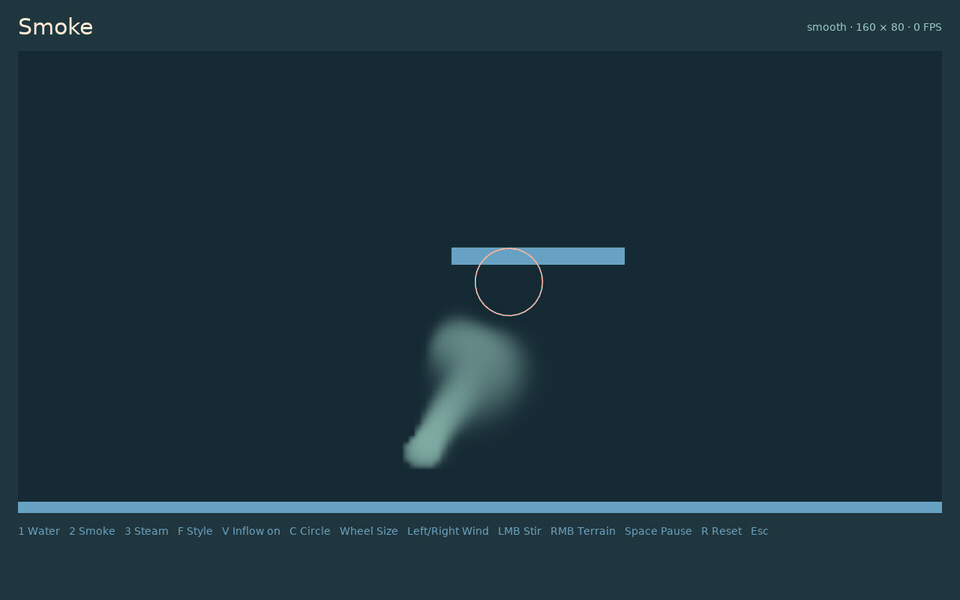
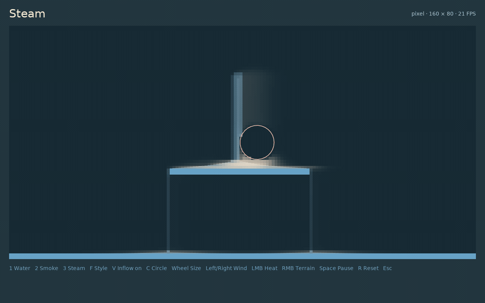

# Smoke and thermal reactions

Gas materials share velocity and pressure fields. Density is advected by wind, accelerated by buoyancy and custom forces, diffused by the finite grid, and reduced through dissipation.



## Configure smoke

```lua
local smoke = world:addMaterial {
  name = 'smoke',
  model = 'gas',
  buoyancy = 55,
  dissipation = 0.12,
  cooling = 0.25,
  color = {0.34, 0.38, 0.44, 0.72},
}

world:newSource {
  material = smoke,
  position = {500, 620},
  radius = 18,
  rate = 900,
  temperature = 2.5,
}

world:setWind(24, -4)
```

Positive buoyancy makes hot gas rise. Cooling moves temperature toward zero; dissipation removes visible density. All gases share motion but retain separate density, heat, color, source, and render settings.

## Add a custom force

```lua
local smoke = world:addMaterial {
  name = 'curling-smoke',
  model = 'gas',
  force = {
    code = [[
      return vec2(sin(position.y * 0.04 + time) * strength, 0.0);
    ]],
    uniforms = {strength=30},
  },
}

smoke:setUniform('force', 'strength', 60)
```

Force code receives `position`, `velocity`, `density`, `temperature`, and `time`, and returns acceleration. Custom render code receives the material color and field values and returns RGBA. Uniform value changes do not rebuild the cached shader variant.

## Convert hot water to steam

```lua
local water = world:addMaterial {
  name = 'water', model = 'water', cooling = 0.05,
}
local steam = world:addMaterial {
  name = 'steam', model = 'gas', buoyancy = 90,
}

world:addReaction {
  from = water,
  to = steam,
  temperatureAbove = 1,
  rate = 0.7,
}

world:addHeat(400, 600, 50, 2, water)
```

The reaction transfers density and proportional heat in the same cell. Its per-step conversion fraction is `1 - exp(-rate * dt)`. Rules run in insertion order and can be started, stopped, retuned, or released.



This mechanism handles material-to-gas conversion. Combustion, sand, freezing, latent heat, gas expansion, bubbles, and equal-and-opposite water/gas forces are outside its current model.
