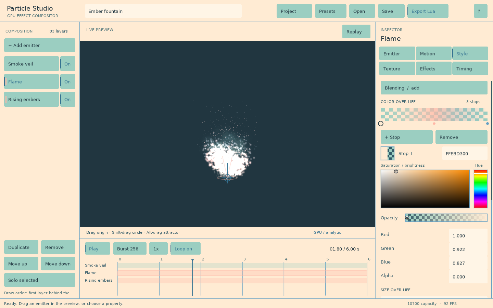

# Particle Studio



A native LÖVE editor for layered GPU particle effects. Run either entry point from the directory containing `particle-gpu`:

```sh
love particle-gpu editor
love particle-gpu/editor
```

On macOS, the executable may be `/Applications/love.app/Contents/MacOS/love`. Press **E** in the root example picker to enter the editor. Both editor launchers use the same `gpuparticles-studio` save directory.

## Build an effect

Choose **Presets** for an ember fountain, arcane bloom, colliding rain, a timed impact burst, pixel embers, spectral wisps, or colliding droplets. Pixel embers and spectral wisps demonstrate embedded sprites and shader effects; colliding droplets starts with self-collision enabled. The left column adds, duplicates, removes, reorders, hides, and solos layers. First in the list draws behind subsequent layers. Visibility is saved and exported; solo is a preview control.

The inspector has six tabs:

- **Emitter:** capacity, emission rate, deterministic seed, lifetime ranges, position, direction/spread, speed, and spawn-area geometry.
- **Motion:** gravity, damping, radial/tangential acceleration, turbulence, curl noise, an attractor, a procedural flow field, circle/floor collision, and optional particle-to-particle contacts.
- **Style:** additive/alpha blending, up to 32 RGBA stops and 32 size stops, variation, rotation, and spin. Click the color ramp to select a stop. Its inline picker shows saturation/brightness, hue, opacity, and a swatch (solid color beside its transparency preview). Drag to choose a color, type an eight-digit `RRGGBBAA` value, or edit the channels below. Drag size-curve points to shape size over life.
- **Texture:** built-in pixel-art sheets, PNG import, image preview, sprite-sheet columns/rows/frame count, nearest or linear filtering, and generated disc/spark/ring/smoke shapes.
- **Effects:** pixel grid, dissolve, outline width/color, palette levels and RGB tint, animated distortion, and glow strength/radius. These process the combined image of the selected layer and leave its simulation mode unchanged.
- **Timing:** emission start/duration and up to 32 timed bursts per layer. Set rate to zero for burst-only effects. Particles finish their lives after their emission window closes.

Click a number to type, or hold and drag the number or its label: right/up increases, left/down decreases. The initial drag direction chooses the axis; hold Shift for finer adjustments. Dragging clamps to the field's minimum and maximum, including paired lifetime/speed limits, and commits one undo step on release. Escape cancels a drag. Scroll the inspector or use Page Up/Down. Tab changes keyboard focus, Enter activates a control, and arrow keys adjust focused numeric controls or curve points. Invalid typed values remain in the field until corrected or canceled with Escape.

Attractor **Strength** is shown as acceleration in px/s² at 100 px from the center, before softening, with a range of −1000 to 1000. For example, the default raw coefficient of 900,000 displays as 90. Positive values attract and negative values repel. Pull falls with distance squared; softening limits the force near the center (and reduces pull at 100 px if softening exceeds 100 px). Saved projects and Lua exports retain the original coefficient, so existing effects keep the same motion.

Color pickers are also visible for **Tint** and for **Outline color** when the outline is enabled, using six-digit `RRGGBB` values. Picker drags clamp to their bounds and create one undo step on release; Escape cancels. Tab focuses the color area, hue strip, or opacity track, and arrow keys adjust them (Shift makes finer changes). The chosen hue stays available when editing black or gray, and RGB/hex edits synchronize the picker. Scroll to reach lower properties.

**Motion → Particles against particles**, at the top of the tab, enables approximate contacts within the selected layer. The **Self collision** toggle advertises its **2048-slot maximum**; enabling it reduces larger capacities to 2048 and reports the change. This is one undoable edit. Capacity controls then respect the limit. Contact radius, bounce, separation strength, and 1–4 iterations are adjustable. Radius is independent of size curves and textures. More iterations improve separation at greater cost; dense piles can still overlap. Contacts do not cross layer boundaries. Projects and Lua exports preserve the setting, and older projects default to off. Disabling it restores analytic mode when no other feature needs stateful simulation. Native fallback omits contacts. Press **S** in the comparison demo to compare the GPU cost with the option off/on, or see [completed-work measurements](../bench/SELF_COLLISION.md).

Choose **Presets → Colliding droplets** for a 1024-particle stream with self-collision and a floor already enabled. It opens Motion so the contact settings are immediately available. Launch it directly with `love particle-gpu editor --preset=7`. [Editor preview](../previews/editor-self.png).

Drag in the preview to position the selected emitter. Hold **Shift** to move its enabled circle collider, or **Alt/Option** to move its enabled attractor. These authoring edits commit once on release and replay the effect to the playhead. They do not modify particle buffers on every mouse event.

The bottom timeline shows emission windows, burst diamonds, and the playhead. Drag the playhead to seek. Analytic effects jump through scheduled events; stateful effects replay in batches of at most 32 simulation steps per editor update, keeping the interface responsive. **Project** changes the composition duration and looping. **Burst 256** auditions an unsaved burst; use Timing to author a persistent event.

The preview fills the space between its controls and the timeline. It preserves the effect's proportions and shows extra world space when the panel is taller or wider than the 960 × 640 reference scene. Particles, shader layers, and dragging all use that same visible area; they are clipped only at its edges. Resizing does not restart playback.

## Textures, pixels, and shaders

Select a layer and open **Texture** to choose **Pixel sparks**, **Pixel flame**, **Pixel smoke**, or **Pixel splash**. These built-in sheets set their frame layout and nearest filtering automatically. Sparks has three 8 × 8 frames; the others have four 16 × 16 frames. Their monochrome artwork takes the emitter's lifetime colors. Selection changes only the texture, supports undo/redo, and embeds the image in saved projects and Lua exports. The **Pixel embers** preset uses the same sparks sheet.

To use your own image, drop a **PNG** onto the window. The image is decoded before the edit is accepted; invalid images leave the project unchanged. Use images up to **1024 × 1024 pixels / 1 MB**. Embedded images have a combined 6 MB encoded budget per project. Import, removal, and sheet settings participate in undo/redo. **Use generated shape** returns to the procedural sprite controls.

A regular sprite sheet runs left to right, then top to bottom, once over each particle's lifetime. Columns and rows must divide the image dimensions; frame count can be smaller than the grid. Reduce frame count before shrinking the grid. Up to 256 frames are supported. The library draws square billboards, so use square source frames when preserving aspect ratio matters. Nearest filtering is suitable for pixel sprites; linear-filtered atlases may need padded edges to avoid neighboring-frame bleed.

**World pixels / cell** selects 1, 2, 4, 8, or 16. A value above 1 renders that layer at reduced resolution and enlarges it with nearest filtering, including rotating sprites. Draw exports at integer positions and integer scales for consistent screen pixels. The editor fits the scene to its viewport, so its displayed grid may be smaller than your game's. Simulation and collision retain full precision.

Shader effects operate on the layer as a whole: outlines follow its combined silhouette, dissolve uses a fixed noise pattern, palette levels quantize each color channel, tint multiplies RGB, distortion animates with the effect clock, and glow adds a local halo. Width, distortion, and glow radius are measured in grid cells. This is not per-particle material editing or full-scene HDR bloom. Appearance-enabled layers require an extra canvas pass; disabled settings retain direct rendering with no processing canvas. The preview sizes these canvases to its visible world area, with room for outline/glow sampling, and reuses them until their dimensions change. Pixel grids and shader patterns stay anchored to world coordinates. Simulation modes remain unchanged. Textured appearance effects are also tested with particles forced onto the native fallback on the target hardware.

[Texture import preview](../previews/editor-texture.png) · [Pixel-art preview](../previews/editor-pixel.png) · [Shader preview](../previews/editor-shaders.png)

## Save, import, and export

**Save** writes `projects/<name>.json` inside LÖVE's save directory. **Open** lists saved projects and opens that folder. You can also drop a saved project JSON onto the window. The import path parses bounded data; it does not evaluate Lua. Switching projects or quitting with edits prompts you to save, discard, or cancel.

On macOS the directory is usually:

```text
~/Library/Application Support/LOVE/gpuparticles-studio/
```

**Export Lua** writes `exports/<name>.lua`. Copy that file and the library's `gpuparticles/` directory into a LÖVE game. No editor files, external libraries, or separate texture assets are needed. The export embeds the same scheduler, configuration conversion, PNG data, sprite generation, and appearance renderer used by the preview. JSON projects also embed their images. Existing version-one projects receive neutral defaults for the new settings when loaded.

```lua
local effect
function love.load()
  effect = require('ember-fountain').new()
end
function love.update(dt) effect:update(dt) end
function love.draw() effect:draw() end -- optional x,y draw translation
function love.quit() effect:release() end
```

Exports expose `update(dt)`, `draw(x,y,bounds)`, `seek(seconds)`, `reset()`, `burst(layerIndex,count)`, and `release()`. The reference scene is 960×640 world pixels. `draw(x,y)` translates the complete effect, including the visible result of collisions simulated in that scene. Appearance processing defaults to that reference rectangle; pass an optional `{x=..., y=..., w=..., h=...}` in untranslated effect coordinates to cover your game's camera area, as the editor preview does. Use a scissor when clipping the final output to a camera viewport. Copy the entire `gpuparticles` folder, including shaders.

| Shortcut | Action |
| --- | --- |
| Space | Play / pause |
| R | Replay from the start |
| Cmd/Ctrl S | Save project |
| Cmd/Ctrl O | Open project |
| Cmd/Ctrl E | Export Lua |
| Cmd/Ctrl D | Duplicate selected layer |
| Cmd/Ctrl Z / Shift Z | Undo / redo |
| Delete / Backspace | Remove selected layer when not editing text |
| F1 | Help |

## Scope and limits

An effect can contain 12 layers with a total capacity of 500,000 particles, at most 250,000 per layer, and a timeline of 0.25–30 seconds. Each layer chooses its cheapest backend automatically; the preview displays the selected layer's actual backend. Collision, an attractor, or a flow field selects stateful simulation. The native fallback omits GPU-only forces and collision and resamples curves to eight stops.

Parameter changes rebuild the affected composition after a short debounce and replay to the playhead. Large stateful effects therefore take longer to edit than analytic ones. Scene capacity is displayed without per-frame GPU readback. The FPS counter includes the editor's UI and preview, so use the comparison/bench projects for performance measurements.

The editor authors the exposed controls above. It does not yet support packed/nonuniform atlases, paint SDFs, edit arbitrary GLSL, animate parameter keyframes, sort alpha particles, or emit new particles from GPU collision callbacks. Imported projects must use this editor's versioned schema. Lifetime curves use evenly spaced stops, matching the library. Collision retains the library's discrete-projection limits.

## Verification and source

```sh
love particle-gpu editor-test
python3 particle-gpu/scripts/verify.py --editor-only --mutations
love particle-gpu editor --smoke --capture
love particle-gpu editor --smoke --capture --compact
love particle-gpu editor --smoke --capture --preset=3
love particle-gpu editor --smoke --capture --preset=5 --texture-tab
love particle-gpu editor --smoke --capture --preset=6
```

Tests cover real UI input, four-direction numeric dragging and bounds, attractor units against GPU state, visible color pickers and their rendered gradients, opacity and hex/RGB synchronization, PNG file drops, rejected images, sprite-sheet frames, pixel-grid uniformity, shader contributions, premultiplied alpha, multi-stop editing, drag undo, document rollback, unsaved-change protection, exact burst boundaries, mode selection, bounded seeking, resource release, JSON/file round trips, and numeric/rendered export parity. The Python verifier runs a textured effect with appearance processing in a separate LÖVE project containing only the generated effect and `gpuparticles/`, captures both editor sizes, and verifies tests fail when picker opacity/gradients, numeric limits, vertical dragging, attractor scaling, filtering, dissolve, blend mode, burst timing, or automatic mode selection is deliberately broken.

The implementation is split into [document](../editor_support/document.lua), [runtime](../editor_support/runtime.lua), [model](../editor_support/model.lua), [storage](../editor_support/storage.lua), reusable [controls](../editor_support/ui.lua), [inspector](../editor_support/inspector.lua), [curves](../editor_support/curves.lua), [view](../editor_support/view.lua), and [application](../editor_support/app.lua). [Design notes](DESIGN.md) record the control and visual conventions.

The standalone editor uses relative symlinks for shared code, as the other example projects do. If your checkout does not preserve symlinks, use `love particle-gpu editor`. To copy the editor itself elsewhere, place real copies of `editor_support/` and `gpuparticles/` beside its `main.lua` and `conf.lua`.
