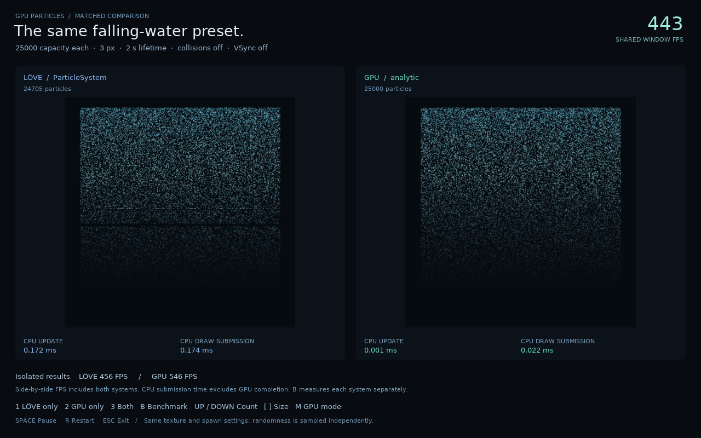

# Native / GPU comparison



```sh
love particle-gpu comparison
# or
love particle-gpu/examples/comparison
```

**1** native only, **2** GPU only, **3** both. **B** measures each independently for three seconds. **Up/Down** changes count, **[/]** changes size, **M** selects analytic/stateful, **Space** pauses, **R** restarts.

Both panels share the texture, emission settings, color curve, particle lifetime, and size in pixels. The native size is converted to a texture scale. Random sampling is independent. Native scheduling may leave some slots empty; live counts are displayed. Collisions start off in both systems.

**C** enables a mouse obstacle. Hover either panel: the circle is shown at matching positions in both, with GPU particles colliding and native particles passing through. Scroll the wheel to change radius. Leaving the particle panels disables contact. Enabling the obstacle selects stateful mode and clears old benchmark results. **B** disables it and restores the previous mode before running a matched benchmark. **M** also exits the collision demonstration.

[Mouse collision preview](../../previews/comparison-mouse.png)

Side-by-side mode has one shared window FPS. The saved isolated results come from frames where only one particle system updates and draws. CPU update and CPU draw-submission timings exclude GPU completion. Both render to 512×512 canvases, regardless of window size. VSync is off; FPS still includes presentation, UI, and LÖVE's event loop. Increase particle size to expose overdraw costs.

Source:

- [model.lua](../../example_support/comparison/model.lua): matching configurations, isolated rendering, measurement windows.
- [view.lua](../../example_support/comparison/view.lua): panels and counters.
- [app.lua](../../example_support/comparison/app.lua): controls and benchmark/capture entry point.
- [tests/comparison.lua](../../tests/comparison.lua): real native backend, texture/size parity, rendered distribution, FPS arithmetic, inactive-system gating, and stateful toggle.

```sh
love particle-gpu comparison-test
love particle-gpu comparison --smoke --benchmark --capture
love particle-gpu comparison --mouse-collision
love particle-gpu comparison --mouse-collision --smoke --capture
```

Capture mode prints the absolute path to `comparison.png` in LÖVE's save directory. The screenshot is taken after both isolated benchmark results are available and the side-by-side view has resumed.

The mouse demo captures `comparison-mouse.png` with a fixed test obstacle. Smoke mode advances simulation deterministically while the FPS counter still measures elapsed frame time. This mode illustrates a capability difference; its FPS is not a benchmark of matching physics.

To copy this example out of the checkout, copy `main.lua`, `conf.lua`, `../../gpuparticles/`, and `../../example_support/` into a new folder as real directories; the checkout uses relative symlinks for shared code.
