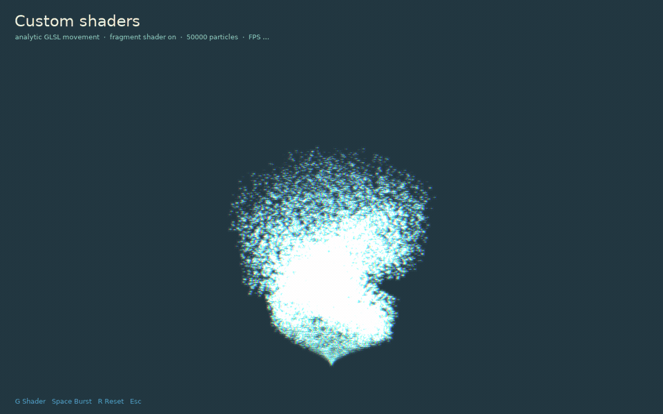

# Custom shaders

This example combines two extension points without modifying gpuparticles:

- `gpu.forces.custom` injects an analytic GLSL displacement into the particle vertex shader. The helix starts at zero displacement, receives `seed` and `age`, and keeps the emitter in analytic mode.
- `aura.glsl` is a regular LÖVE fragment shader. The example draws the emitter to a transparent canvas, then applies color separation and an eight-tap glow while compositing that canvas.

Run it from the repository root:

```sh
love examples/custom-shaders
```

Press **G** to compare the raw particles with the fragment effect, **Space** for a burst, and **R** to reset. The canvas pass adds fill-rate and texture-sampling cost; the custom analytic movement itself still uses one instanced particle draw and no per-particle CPU update.


