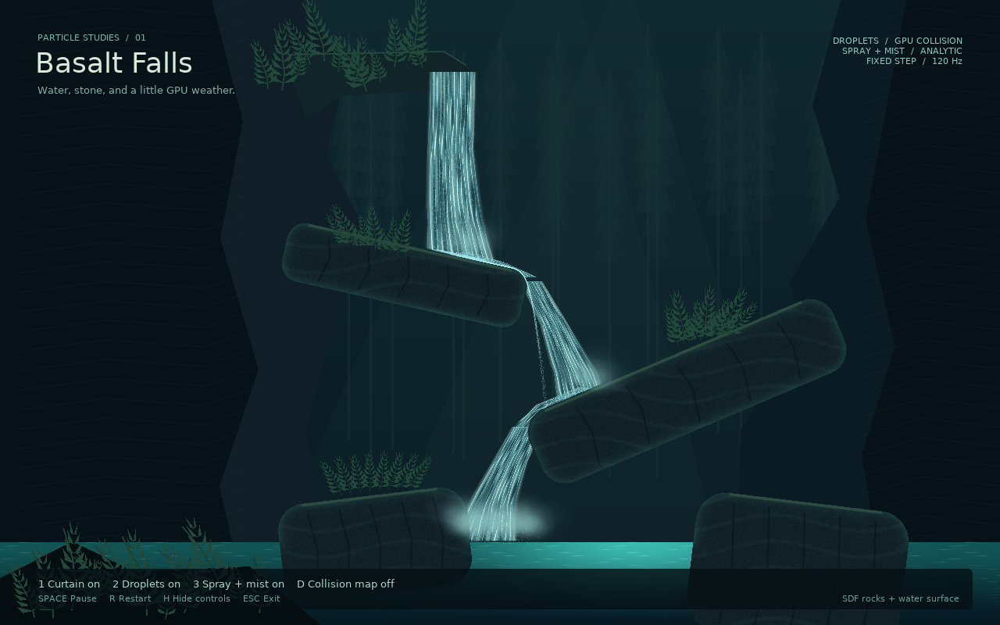

# Basalt Falls



```sh
love particle-gpu waterfall
# or
love particle-gpu/examples/waterfall
```

Three layers make the waterfall:

1. Shader-animated ribbons form the continuous water curtain.
2. Stateful GPU droplets collide with a signed-distance field containing the rocks and pool surface.
3. Analytic spray and mist decorate authored impact locations.

**1/2/3** toggle those layers. **D** shows the collision field, **Space** pauses, **R** restarts, **H** hides the HUD, and **Esc** exits. Hidden layers continue to simulate.

The mouse controls a circular obstacle while inside the scene. Scroll to change its radius; **C** toggles it. The circle and terrain both affect stateful droplets. Movement updates uniforms, without regenerating the terrain field or uploading particle records. The water curtain is visually clipped around the circle; decorative spray/mist do not collide. This is discrete projection, so fast mouse movement can skip particles and does not impart mouse velocity.

[Mouse collision preview](../../previews/waterfall-mouse.png)

Edit [terrain.lua](../../example_support/waterfall/terrain.lua) to move, resize, or rotate rocks. Drawing and the distance-field generator use the same shape definitions. The 640×400 float texture covers a 1280×800 world and stores signed distance in world pixels. Its linear filtering is intentional; particle-state canvases remain nearest-filtered. If the rocks move, rebuild the field and adjust the artistic ribbons/impact emitters to match.

[scene.lua](../../example_support/waterfall/scene.lua) contains emission settings, bounce/friction, and the fixed 120 Hz simulation clock. [render.lua](../../example_support/waterfall/render.lua) and its shaders provide the canyon, curtain, pool, and overlays. Emitters are released before their caller-owned distance texture.

This is an environmental effect, not a fluid solver. Droplets do not interact, accumulate volume, or generate CPU collision events. Spray is emitted at predefined locations. Collision uses discrete projection; very fast particles can cross thin obstacles between steps. When emitter fallback is active, droplets no longer collide, as labeled in the HUD. The demo's artwork itself requires GLSL 3 and float-texture support.

```sh
love particle-gpu waterfall-test
love particle-gpu waterfall --smoke --capture
love particle-gpu waterfall --mouse-collision --smoke --capture
```

The numeric tests shoot particles into both sloped ledges and assert corrected position and reflected velocity. A collision-disabled control must penetrate each ledge. They also inspect thousands of warmed particle states, require flow to the lower cascade, assert backend modes, and independently measure each visual layer's contribution. Capture mode prints the absolute path to `waterfall.png` in LÖVE's save directory.

To copy this example out of the checkout, copy `main.lua`, `conf.lua`, `../../gpuparticles/`, and `../../example_support/` into a new folder as real directories; the checkout uses relative symlinks for shared code.
